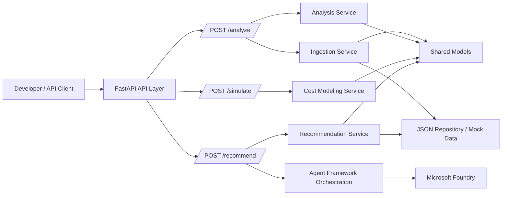

# Azure AI Search Advisor

Azure AI Search Advisor is a scaffolded FastAPI service for teams that want to analyze Azure AI Search workloads, understand cost drivers, and generate optimization recommendations before building full production logic.

It is designed for platform engineers, cloud architects, consultants, and internal developer teams who need a clear starting point for:

- evaluating Azure AI Search topology and feature usage
- modeling dedicated vs. serverless trade-offs
- generating recommendations for right-sizing and feature adoption
- extending an advisor workflow with Microsoft Agent Framework and Microsoft Foundry

> Current status: the repository is an implementation-ready scaffold. The API shape, package boundaries, and extension points are in place; business logic is intentionally left as TODOs.

## Why this project exists

Azure AI Search deployments can become expensive or hard to reason about when replicas, partitions, semantic ranking, vector search, and enrichment workloads evolve over time. This project creates a foundation for an advisor that can:

- ingest workload configuration and usage signals
- detect inefficiencies and over-provisioning
- simulate cost and capacity scenarios
- recommend practical changes with clear reasoning

## Architecture overview



### Runtime components

- **FastAPI app** (`src/azure_ai_search_advisor/main.py`) wires the API surface.
- **Route modules** expose `/analyze`, `/recommend`, and `/simulate`.
- **Domain services** hold the future analysis, recommendation, ingestion, and cost logic.
- **Orchestration** is reserved for Microsoft Agent Framework workflow coordination.
- **Integrations** isolate Microsoft Foundry client creation.
- **Repositories** provide a seam for JSON-backed mock inputs and persisted outputs.

## Quick start

### Prerequisites

- Python 3.11+
- `pip` (or your platform's Python packaging equivalent)
- Optional: Docker and Docker Compose
- Optional: **Microsoft Foundry** project for model deployments and AI capabilities

### Local development

```bash
python3 -m venv .venv
source .venv/bin/activate
python -m pip install -e .
cp .env.example .env
python -m uvicorn azure_ai_search_advisor.main:app --reload
```

> On Debian/Ubuntu, install `python3-venv` first if `python3 -m venv` is unavailable.

The API will be available at:

- `http://127.0.0.1:8000`
- Swagger UI: `http://127.0.0.1:8000/docs`
- ReDoc: `http://127.0.0.1:8000/redoc`

### Docker

```bash
cp .env.example .env
docker compose up --build
```

## UI prototype

A React + TypeScript prototype lives in [`ui/`](ui/README.md). It uses Vite for local development, Azure browser identity for local auth, and Azure Static Web Apps auth hooks for deployed chat experiences.

## Infrastructure

Infrastructure as Code is available under [`infra/`](infra/README.md) to provision the Microsoft Foundry backend. Choose [Bicep](infra/bicep/) or [Terraform](infra/terraform/) — both deploy the same flat-project resources.

## API reference

All endpoints are scaffolded `POST` routes today. They currently return placeholder `not_implemented` responses while preserving the intended API surface.

### `POST /analyze`

Analyze an Azure AI Search workload configuration and usage profile.

```bash
curl -X POST http://127.0.0.1:8000/analyze \
  -H 'Content-Type: application/json' \
  -d '{
    "serviceName": "contoso-search",
    "pricingTier": "standard",
    "replicas": 3,
    "partitions": 2,
    "features": {
      "semanticRanker": true,
      "vectorSearch": true,
      "aiEnrichment": false
    }
  }'
```

Example scaffold response:

```json
{
  "status": "not_implemented",
  "detail": "TODO: Connect ingestion and analysis services to evaluate workloads."
}
```

### `POST /recommend`

Generate optimization guidance from the analyzed workload.

```bash
curl -X POST http://127.0.0.1:8000/recommend \
  -H 'Content-Type: application/json' \
  -d '{
    "serviceName": "contoso-search",
    "goal": "reduce_cost",
    "constraints": {
      "maintainSemanticSearch": true,
      "maxLatencyMs": 300
    }
  }'
```

Example scaffold response:

```json
{
  "status": "not_implemented",
  "detail": "TODO: Connect recommendation agents and response contracts."
}
```

### `POST /simulate`

Model cost and capacity outcomes for proposed changes.

```bash
curl -X POST http://127.0.0.1:8000/simulate \
  -H 'Content-Type: application/json' \
  -d '{
    "serviceName": "contoso-search",
    "current": {
      "replicas": 3,
      "partitions": 2
    },
    "proposed": {
      "replicas": 2,
      "partitions": 2,
      "pricingModel": "serverless"
    }
  }'
```

Example scaffold response:

```json
{
  "status": "not_implemented",
  "detail": "TODO: Connect scenario simulation and cost modeling services."
}
```

## Project structure

```text
.
├── Dockerfile                      # Container image for the FastAPI service
├── docker-compose.yml              # Local container orchestration
├── pyproject.toml                  # Python package metadata and dependencies
├── ui/                             # React + Vite frontend prototype for advisor chat
├── SQUAD_BOOTSTRAP.md              # Original bootstrap brief and execution plan
├── data/
│   ├── inputs/                     # Placeholder location for mock advisor inputs
│   └── outputs/                    # Placeholder location for sample reports/results
├── src/azure_ai_search_advisor/
│   ├── main.py                     # FastAPI application factory and app instance
│   ├── api/
│   │   ├── dependencies.py         # Shared dependency wiring seam
│   │   └── routers/                # Route modules for public endpoints
│   ├── analysis/                   # Inefficiency detection service layer
│   ├── core/                       # Shared configuration objects
│   ├── cost_modeling/              # Pricing and capacity simulation logic
│   ├── ingestion/                  # Input normalization and validation
│   ├── integrations/azure_ai_foundry/  # Microsoft Foundry client factory
│   ├── models/                     # Shared Pydantic contracts
│   ├── orchestration/              # Microsoft Agent Framework orchestration layer
│   ├── recommendations/            # Recommendation synthesis service
│   └── repositories/               # JSON-backed data access seam
└── tests/                          # Placeholder for automated test coverage
```

## Development guide

### Add a new analyzer

1. Create or expand logic in `src/azure_ai_search_advisor/analysis/service.py`.
2. Add any request/response contracts in `src/azure_ai_search_advisor/models/`.
3. If the analyzer needs pre-processing, extend `ingestion/service.py` and `ingestion/validators.py`.
4. Expose the analyzer through `api/routers/analyze.py` or orchestration flows as needed.
5. Add tests under `tests/` when behavior becomes concrete.

### Add a new recommendation workflow

1. Extend `recommendations/service.py` with a new recommendation path.
2. Use `orchestration/registry.py`, `orchestration/agents/`, and `orchestration/tools/` to coordinate multi-agent reasoning in Microsoft Foundry.
3. Add Microsoft Foundry wiring in `integrations/azure_ai_foundry/client.py` if model-backed reasoning is required.
4. Keep route handlers thin; push decision-making into services.

### General extension guidelines

- Keep API handlers focused on transport concerns.
- Keep Azure-specific integrations isolated behind `integrations/`.
- Use `models/` for shared contracts instead of ad hoc dictionaries once schemas are finalized.
- Prefer adding new domain packages over overloading route modules with business logic.

## Configuration

### Environment variables

Create a local `.env` from `.env.example`.

| Variable | Required | Purpose |
| --- | --- | --- |
| `AZURE_AI_FOUNDRY_ENDPOINT` | Yes for Azure-backed workflows | Microsoft Foundry project endpoint |
| `AZURE_AI_FOUNDRY_MODEL` | Yes for Azure-backed workflows | Model deployment name used for reasoning workloads |

Authentication uses `DefaultAzureCredential` — no API keys. Supports managed identity, `az login`, workload identity, and environment credentials automatically.

### Azure setup notes

To connect this scaffold to a real model backend:

1. Create a **Microsoft Foundry** project at https://ai.azure.com.
2. Deploy a model (e.g., gpt-4o) within the Foundry project.
3. Copy the project endpoint and model name into `.env`.
4. Ensure your identity has the appropriate RBAC role (e.g., `Cognitive Services OpenAI User`).
5. Implement environment-backed settings in `src/azure_ai_search_advisor/core/config.py`.
6. Complete client creation in `src/azure_ai_search_advisor/integrations/azure_ai_foundry/client.py`.

## Developer workflow

Useful commands:

```bash
# install locally
python -m pip install -e .

# run the app
python -m uvicorn azure_ai_search_advisor.main:app --reload

# verify Python sources compile
python3 -m compileall src
```

> Note: the repository currently contains scaffold code and a placeholder `tests/` directory, so there is no automated pytest suite yet.

## Future enhancements

Planned next-step enhancements from the bootstrap brief:

- Natural language questions such as: "Why is my cost high?"
- Azure Cost Management integration
- Azure Monitor metrics integration
- Export recommendations as JSON or Markdown reports
- Deeper Microsoft Foundry integration for agent workflows and future APIM/A2A scenarios

## Contributing

See [CONTRIBUTING.md](CONTRIBUTING.md) for the expected contribution flow.
